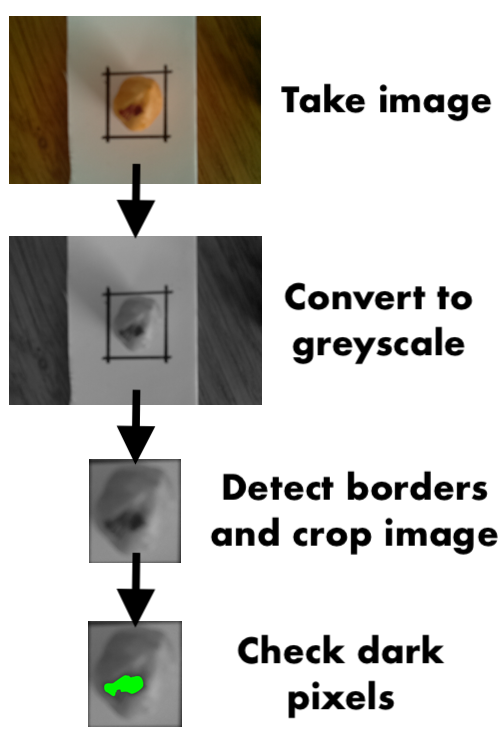

# hazel-score

Classify hazelnuts using a Raspberry Pi.

See detailed explanation in this blog post: [Classifying hazelnuts using a Raspberry Pi](https://www.kleemans.ch/classifying-hazelnuts-using-a-raspberry-pi)

### Flow

The algorithm to detect dark spots is really simple (see `score.py`) and only works with constant brigthness.

### Run

Install requirements using

    pip3 install -r requirements.txt
    
Start `main.py` on your Raspberry to capture a photo every 5 seonds and classify the result.

Run test:

    python3 test-score.py

